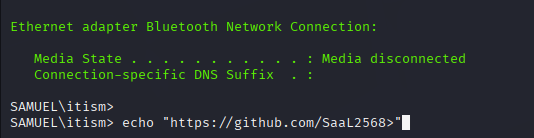
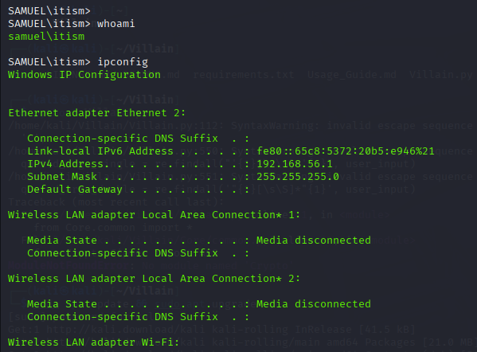
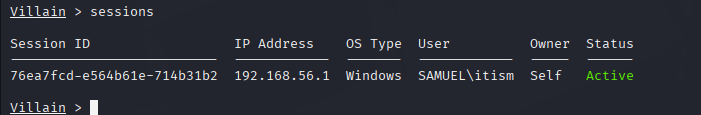

# Villain Framework Reverse Shell Report

## ⚙️ Setup Info
- Payload: `windows/reverse_tcp/powershell`
- LHOST: 192.168.56.101
- LPORT: 1500

## 🔁 Payload Delivery Method
- The payload that was generated when Villain.py was executed was copied into clipboard. This was then
executed in Windows Powershell on the target PC. This gave us a backdoor connection to this PC from the
attacker VM. Now we can execute any arbitrary commands and gather information as we please.

## 🖥️ Captured Info
- Hostname: SAMUEL
- IP Address: 192.168.56.1
- User: itism

## 🔎 Enumeration Performed
```powershell
whoami
ipconfig
systeminfo

## 🖼️ Screenshots



