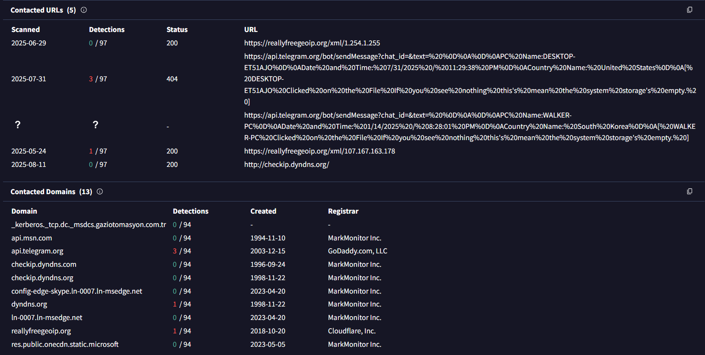

## 🦠 Assignment 2: VirusTotal File Analysis

### 🔗 Resources
- ZIP File (Password: `infected`): [malware_sample.zip](https://github.com/sector21/DigitalForensicsNotes/blob/main/resources/Forensics-image.png)

### ✅ Task
Upload the sample to [https://virustotal.com](https://virustotal.com), analyze the scan results, and document key findings.

# VirusTotal Analysis Report

## 📁 File Info
- Filename: malware_sample.zip
- File inside: malware_sample.docx
- Hashes:
  - MD5: 548ca0ad45bfe4628a64ae4c77aaa67b
  - SHA1: 7a39d22de41cdd04b2cd8bc08444af731e96ec56
  - SHA256: f630d61a35d98b69b7d9e22200030dcf4752932860872142dfac8acda031bdc7

## 🧪 Detection
| Engine | Detection |
|--------|-----------|
| ExampleAV | Trojan.Macro.Gen |

## 📡 Network Indicators
-api.telegram.org
-reallyfreegeoip.org

## 📊 Behavioral Summary
Sandboxes flag this file as a malware that is capable of stealing files.It attempted to modify windows defender settings.
It injected privilege escalation code into running processes. It harvested information related to installed mail clients.

## 🔐 Public Link
https://www.virustotal.com/gui/file/ae2a513b61febc225d5e374ab22dba754a3d38e49b7bbd442fe3f9bab16b8fb1/detection

## 🖼️ Screenshots

